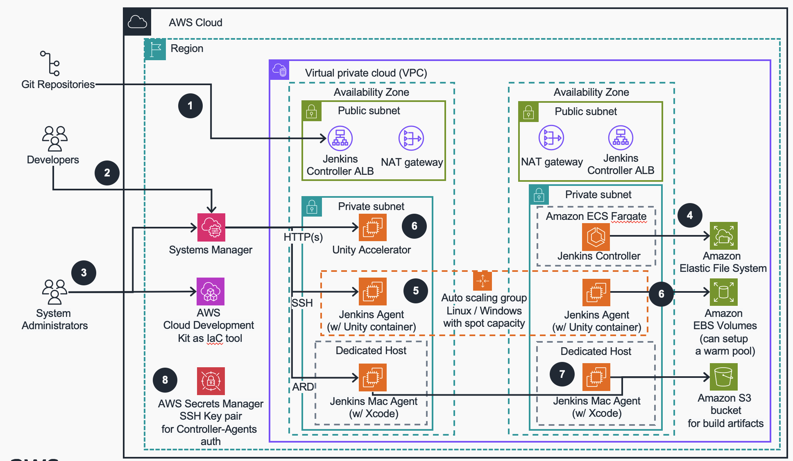

# Guidance for developing Apple Vision Pro applications with Unity on Amazon EC2 on AWS 

AWS blog: [Implementing a Build Pipeline for Unity Mobile Apps](https://aws.amazon.com/blogs/gametech/implementing-a-build-pipeline-for-unity-mobile-apps/)

#### Table of Contents

List the top-level sections of the README template, along with a hyperlink to the specific section.


1. [Overview](#overview)
    * [Cost](#cost)
2. [Prerequisites](#prerequisites)
    * [Operating System](#build-requirements)
3. [Deployment Steps](#deployment-steps)
4. [Deployment Validation](#deployment-validation)
5. [Running the Guidance](#running-the-guidance)
6. [Next Steps](#next-steps)
7. [Cleanup](#cleanup)


#### Overview 

This guidance describes architectural considerations and configuration steps for developing and building Unity-based Apple Vision Pro applications using AWS services. It demonstrates how to implement a resilient, scalable, cost efficient and secure build pipeline on AWS, leveraging services such as Amazon EC2, Amazon ECS, and Amazon S3.

The intended audience of this guidance are DevOps engineers, Cloud architects, system administrators, and platform engineers who would like to get hands-on experience architecting cloud-native applications for Apple Vision Pro in the AWS Cloud and are familiar with Unity and iOS development.

#### Architecture overview

Below is an architecture diagram of the Unity build pipeline for Apple Vision Pro applications using AWS services.

##### Architecture diagram and workflow steps




1. Source code is stored in a git code repository and is pulled by Jenkins on a build start. Developers access Jenkins Controller interface via an Application Load Balancer
2. Developers and System Administrators access EC2 Mac instances via Apple Remote Desktop (ARD), Linux agents via SSH and Unity Accelerator via HTTP using Systems Manager
3. System Administrators deploy and manage the infrastructure using AWS Cloud Development Kit
4. Jenkins Controller is deployed on Amazon Elastic Containers Service (ECS) Fargate via Amazon CDK. To guarantee redundancy, Amazon Elastic File Service (EFS) is used.
5. The first build stage (generating Xcode project from Unity source code), is run on Amazon Elastic Compute Cloud (Amazon EC2) Spot Instances. These are placed into an Auto Scaling group for scalability and redundancy.
6. Jenkins agent instances utilize Amazon Elastic Block Storage (EBS) Volumes and Amazon Simple Storage Service (S3) for repository and build asset caching mechanics. Also Unity Accelerator can be used for Unity asset caching
7. The resulting XCode project is transferred to a Jenkins worker on one of Amazon EC2 Mac Instances to finalize and sign the build and export .ipa file.
8. An .ipa archive file is exported as a Jenkins artifact and stored in Amazon Simple Storage Service (Amazon S3) bucket.
9. Certificates, private keys, and provisioning profiles are stored in AWS Secrets Manager and dynamically pulled onto the Mac during a build.

Following this architecture, you should be able to:

* Develop and build Unity applications for Apple Vision Pro using AWS services
* Create an infrastructure that provides a scalable and cost-effective build pipeline for Vision Pro applications

#### AWS services used in this Guidance

| AWS service |	Role |	Description |
| --------------------| ----------------- | -------------------------------|
| Amazon EC2 |	Core service |	Hosts Linux and Mac instances for Unity builds and iOS compilation |
| Amazon ECS |	Core service |	Runs the Jenkins Controller on Fargate |
| Amazon S3	| Core service |	Stores build artifacts and intermediary files |
| Amazon VPC |	Core Service |	Provides network isolation and security |
| Amazon Autoscaling |	Core Service |	Provides flexifility and cost efficiency | 
| Systems Manager |	Supporting service |	Manages EC2 instances and provides secure access |
| NAT Gateway |	Supporting service |	Enables outbound internet access for private resources |
| Elastic Load Balancing |	Supporting service |	Provides load balancing for the Jenkins Controller |

#### Plan your deployment

This guidance is based on using Amazon EC2 instances to host Unity builds and iOS compilation. It leverages Amazon ECS Fargate to run the Jenkins Controller for orchestrating the build pipeline and Amazon Autoscaling to adjust solution flexibility. You can extend the solutionby using containers to build Unity images, different EC2 Linux instances to adjust assets compilation phase and different EC2 Mac instances in combination with regular capacity adjustments for optimal cost control, security and build speed. 

#### Cost 

You are responsible for the cost of the AWS services used while running this solution guidance. As of July 2024, the cost for running this guidance with the default settings in the US East (N. Virginia) Region is approximately $688 per month for processing (1000 builds).
We recommend creating a Budget through AWS Cost Explorer to help manage costs. Prices are subject to change. For full details, refer to the pricing webpage for each AWS service used in this Guidance.

##### Estimated monthly cost breakdown

The following table provides a sample cost breakdown for deploying this guidance in the US East (N. Virginia) Region for one month.


| AWS service |	Dimensions |	Cost [USD] |
| --------------------| ----------------- | -------------------------------|
| Amazon ECS (Fargate)	| 1 task running 24/7 |	$36 |
| Amazon EC2 (Linux Spot) |	 c5.xlarge spot instances, 24/7 usage |	$48 |
| Amazon EC2 (Mac) |	1 mac2.metal instance, 24/7 usage |	$491 |
| Amazon S3 |	100 GB storage, 1000 PUT/COPY/POST/LIST requests |	$3 |
| NAT Gateway | 2 NAT Gateways, 100 GB data processed	| $70 |
| Application Load Balancer |	1GB processed bytes |	$16 |
| Amazon EBS |	3x 100GB volumes, 24/7 usage	| $24 |
| Amazon EFS |	1GB storage | 	$0.20 |
| TOTAL | estimate |	$688 |

#### Prerequisites 

Before you begin deploying this guidance, ensure you have the following prerequisites in place:

AWS Account and Permissions

1. An AWS account with permissions to create and manage the required resources.
2. AWS CLI installed and configured with appropriate credentials.

##### Build requirements: 

First, prepare an environment where AWS CDK can be executed. This environment must meet the following conditions:

* Required software is installed 
    * Node.js
        * Version 16 or higher is recommended
        * Can be checked with the node -v command
    * AWS CLI
        * Version 2 is recommended
        * Can be checked with the aws --version command
    * Docker 
        * Can be checked with the docker --version command
* Appropriate AWS IAM permissions (equivalent to Administrator) are set for AWS CLI 
    * Configure IAM role settings or enter IAM user information using the aws configure command
* Connected to the internet and able to communicate with AWS API 
    * May not work properly in closed environments

If your environment meets the above conditions, it can be used on local terminals, AWS Cloud9, EC2 instances, etc. 

####  iOS Development Requirements

1. Apple Developer Account: Required for signing and deploying Vision Pro applications.
2. Xcode: Latest version compatible with Vision Pro development.
3. Provisioning profiles and certificates for iOS/Vision Pro development.

##### Networking

Ensure you have the necessary network access to create and manage AWS resources, including VPCs, subnets, and security groups.

##### Service Quotas

Verify that your AWS account has sufficient service quotas, especially for:

* Amazon EC2 instances (including Mac instances)
* Amazon ECS tasks
* VPCs and subnets
* NAT Gateways

##### Security

* Familiarity with AWS IAM for managing permissions and roles.
* Understanding of network security concepts for configuring VPCs and security groups.

##### Knowledge Prerequisites

* Basic understanding of Unity development for Apple Vision Pro.
* Familiarity with AWS services, especially EC2, ECS, and S3.
* Experience with CI/CD pipelines, preferably Jenkins.

By ensuring these prerequisites are met, you'll be well-prepared to deploy and use this guidance effectively.

##### Preparing to Use CDK

Navigate to the root directory of this prototype (the directory containing README.md) and execute the following commands. Note that all subsequent cdk commands are assumed to be executed in this root directory.

```shell
# Install Node dependencies
npm ci

# Initialize CDK for use in your AWS environment

npx cdk bootstrap
```

npm ci installs Node dependencies. This is only necessary the first time.
cdk bootstrap performs initial setup to use CDK in your environment. This is necessary when using CDK for the first time in a particular AWS account and region. It's not needed for subsequent uses.
✅ If you see a message like "Environment aws://xxxx/ap-northeast-1 bootstrapped", it's successful. Proceed to the next step.

##### Supported AWS Regions

The AWS services used for this guidance are supported in all AWS regions where Amazon EC2 Mac instances are available. Please check the AWS Regional Services List for the most up-to-date information.

#### Deployment Steps 

We assume that you have already built a build pipeline, but for detailed instructions on how to build it, please refer to the following link: Build Pipeline CDK Project Deployment Steps. You can deploy using AWS CDK, and it only takes a few CLI commands to deploy.

##### 1. Set parameters

Before you deploy it, you need to set several parameters.

The Jenkins controller's initial admin password is set in [jenkins.yaml.ejs](lib/construct/jenkins/resources/config/jenkins.yaml.ejs).
It is recommended to update the password to a sufficiently strong one (the default is passw0rd.)

```shell
      users:
        - id: admin
          password: passw0rd
```

Please open [bin/jenkins-unity-build.ts](./bin/jenkins-unity-build.ts). There are a few parameters you can configure.

```shell
new JenkinsUnityBuildStack(app, 'JenkinsUnityBuildStack', {
  env: { 
    region: 'us-east-2',
    // account: '123456789012',
  },
  allowedCidrs: ['127.0.0.1/32'],
  // certificateArn: "",
});
```
The allowedCidrs property specifies IP address ranges that can access the Jenkins web UI ALB.
You should set these ranges as narrowly as possible to prevent unwanted users from accessing your Jenkins UI.

To change the AWS region (the default is us-east-2, Ohio), please replace region property.

For additional security, you can create an AWS Certificate Manager certificate, and import it by setting certificateArn and env.account in the above code to encrypt the data transferred through the ALB with TLS. By default, Jenkins Web GUI is accessed via HTTP.

##### 2. Run cdk deploy

After CDK bootstrapping, you are ready to deploy the CDK project by the following command:

```shell
npx cdk deploy
```
The first deployment should take about 15 minutes. You can also use the npx cdk deploy command to deploy when you change your CDK templates in the future.

After a successful deployment, you will get a CLI output as below:

```shell
 ✅  JenkinsUnityBuildStack

✨  Deployment time: 67.1s

Outputs:
JenkinsUnityBuildStack.JenkinsControllerServiceLoadBalancerDNS8A32739E = Jenki-Jenki-1234567890.us-east-2.elb.amazonaws.com
JenkinsUnityBuildStack.JenkinsControllerServiceServiceURL6DCB4BEE = http://Jenki-Jenki-1234567890.us-east-2.elb.amazonaws.com
```
By opening the URL in JenkinsControllerServiceServiceURL output, you can now access to Jenkins Web GUI. Please login with the username and password you entered in jenkins.yaml.ejs.

You can also configure to deploy EC2 Mac instances or a Unity accelerator instance. For further details, please refer to the document here.

#### Deployment Validation  

To validate the deployment:

1. Open the CloudFormation console and verify the status of the stack named "UnityVisionProBuildPipeline".
2. Check the ECS console to ensure the Jenkins master task is running.
3. Verify that the EC2 instances (Linux and Mac) are created and running.
4. Access the Jenkins UI using the URL provided in the CloudFormation outputs.

##### Running the Guidance 

To run the Guidance:

1. In the Jenkins UI, navigate to the pipeline you created.
2. Click "Build Now" to start the build process.
3. Monitor the build progress in the Jenkins console output.
4. Once complete, you can download the built artifacts from Jenkins.

Expected output: A successfully built Xcode archive for your Vision Pro application. Please refer to the blog article for further details.

#### Next Steps 

* Customize the Unity project and build settings to fit your specific Vision Pro application needs.
* Integrate additional testing steps in the Jenkins pipeline.
* Implement automatic deployment to TestFlight or the App Store.
* Optimize the build process by fine-tuning EC2 instance types and sizes.

#### Cleanup 

When deleting resources, please follow these steps:
First, set the number of instances in the Jenkins EC2 Fleet to 0. To do this, go to the Jenkins cloud management page (Dashboard → Manage Jenkins → Nodes → Configure Clouds) and set the Minimum Cluster Size of EC2 Fleet to 0.
After confirming that all Linux/Windows Agents have been removed from the Jenkins GUI, execute the following CDK command:

```shell
npx cdk destroy --all
```

Also, we've configured some resources not to be deleted automatically. Please follow these steps to delete them manually:

* EC2 Mac Dedicated host: You cannot release the Dedicated host for 24 hours after creating it, and for 1-3 hours (Pending state) after terminating the Mac instance (reference). Please try after sufficient time has passed. To release, select the host on this page and click Actions → Release host.

