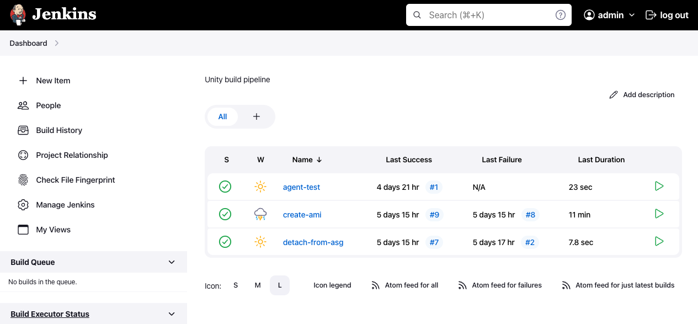
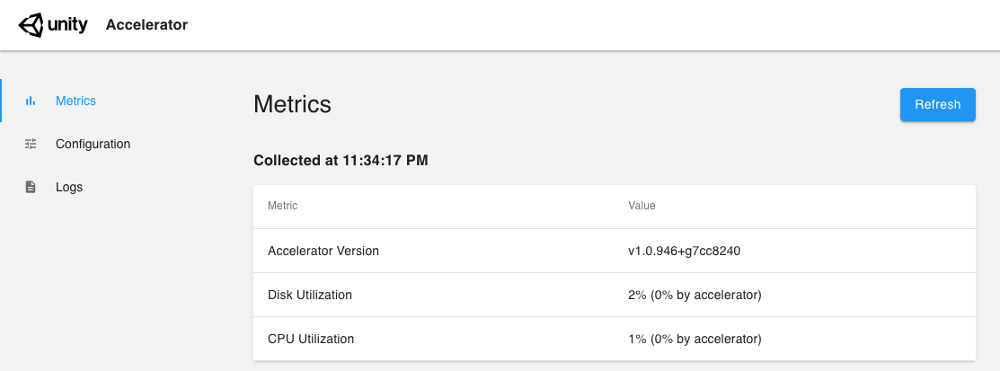
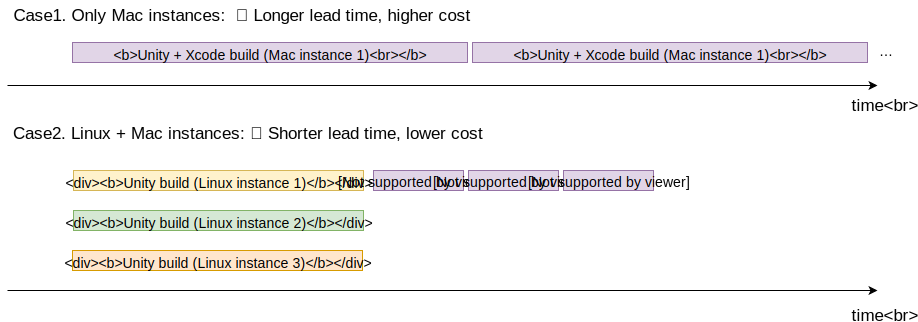
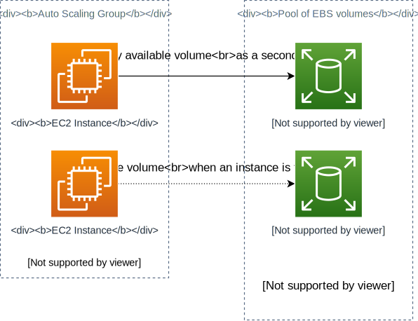

# Unity Build Pipeline with Jenkins and EC2 Mac
[](https://github.com/aws-samples/jenkins-unity-build-on-aws/actions/workflows/build.yml)

This is a starter kit for Unity build pipeline with Jenkins and EC2 Linux/Mac instances on AWS.

Features include:

* Jenkins controller on ECS Fargate
* Jenkins agents on EC2 Linux Spot and EC2 Mac instances
* Optional container support for Jenkins agents
* Unity Accelerator on EC2
* Periodic AMI replacement to keep build cache warm
* Mostly automated provisioning by AWS Cloud Development Kit (CDK)

## Overview
Here is the architecture of this project. 
Please also read [How it works section](#how-it-works) for additional consideration on this architecture.


All the AWS resources in the diagram are provisioned automatically via AWS CDK.

## Deploy
To deploy this project to your own AWS account, please follow the steps below.

### 0. Prerequisites
You need the following dependencies installed to deploy this sample:

* [Node.js](https://nodejs.org/en/download/) (v16 or newer)
* [Docker](https://docs.docker.com/get-docker/)
* [AWS CLI](https://docs.aws.amazon.com/cli/latest/userguide/getting-started-install.html) and a configured IAM profile with Administrator policy

### 1. Set parameters
Before you deploy it, you need to set several parameters.

Jenkins controller's initial admin password is set in [jenkins.yaml.ejs](lib/construct/jenkins/resources/config/jenkins.yaml.ejs).
It is recommended to update the password strong enough (the default is `passw0rd`.)

```yaml
      users:
        - id: admin
          password: passw0rd
```

Please open [bin/jenkins-unity-build.ts](./bin/jenkins-unity-build.ts) and find the property named `allowedCidrs`.
This property specifies the CIDRs that can access the Jenkins web UI ALB.
You should set this as narrowly as possible to prevent unwanted users from accessing your Jenkins control panel.

To change the AWS region to deploy this samples to (the default is us-east-2 Ohio), please replace `region: us-east-2` in the file.

```ts
new JenkinsUnityBuildStack(app, 'JenkinsUnityBuildStack', {
  env: { 
    region: 'us-east-2',
    // account: '123456789012',
  },
  allowedCidrs: ['0.0.0.0/0'],
  // certificateArn: "",
  // macAmiId: 'ami-013846afc111c94b0', // Monterey M1 mac @us-east-2
});
```

For additional security, you can [create an AWS Certificate Manager certificate](https://docs.aws.amazon.com/acm/latest/userguide/gs-acm-request-public.html), and import it by setting `certificateArn` and `env.account` in the above code to protect the ALB with TLS.
By default, Jenkins Web GUI can be accessed only via HTTP.

### 2. Setup CDK
After confirming the parameters, you can proceed to CDK deployment.

First, you need to setup the CDK environment by running the following command:

```sh
npm ci
npx cdk bootstrap
```

You only need those commands once for your AWS environment (pair of account ID and region.)

### 3. Run cdk deploy
Now you can deploy your CDK project.

```sh
npx cdk deploy
```

Initial deployment usually takes about 15 minutes. You can also use `npx cdk deploy` command to deploy when you modify your CDK templates in the future.

After a successful deployment, you will get a CLI output as below:

```
 ✅  JenkinsUnityBuildStack

✨  Deployment time: 67.1s

Outputs:
JenkinsUnityBuildStack.JenkinsMacAgent1InstanceId39041E59 = i-xxxxxxxxxxx
JenkinsUnityBuildStack.JenkinsMasterServiceLoadBalancerDNS8A32739E = Jenki-Jenki-1234567890.us-east-2.elb.amazonaws.com
JenkinsUnityBuildStack.JenkinsMasterServiceServiceURL6DCB4BEE = http://Jenki-Jenki-1234567890.us-east-2.elb.amazonaws.com
JenkinsUnityBuildStack.UnityAcceleratorEndpointC89B3A26 = accelerator.build:10080
JenkinsUnityBuildStack.UnityAcceleratorInstanceIdC7EEEEA7 = i-yyyyyyyyyyy
```

Opening the URL in `JenkinsMasterServiceServiceURL` output, you can now try the sample app on your browser.
Please login with the username and password you entered in `jenkins.yaml.ejs`. 

**NOTE:** You may observe Jenkins controller initialization process taking longer time (>3 minutes), because Jenkins must copy all the required files to an [Amazon EFS volume](https://aws.amazon.com/efs/) on the very first boot. If you see a 503 error, please reload the page after several minutes and you will get a login page soon. You will NOT experience this initialization after the second boot since all the files are already copied to the EFS volume.



### 4. Provision EC2 Mac instance
Note that EC2 Mac instance is not provisioned yet.
To provision one, **you have to uncomment `macAmiId` property** in [bin/jenkins-unity-build.ts](./bin/jenkins-unity-build.ts) and provide an AMI ID for the instance.
(Technically, you do NOT have to separately deploy Mac instances and other resources, but in this sample we intentionally separate them to avoid possible rollback and rollback failure. A Mac dedicated host has [some limitation](https://docs.aws.amazon.com/AWSEC2/latest/UserGuide/ec2-mac-instances.html#mac-instance-release-dedicated-host) which complicate the CloudFormation rollback process.)

You can get an AMI ID for Mac instances from this page: [AMI Catalog](https://console.aws.amazon.com/ec2/v2/home#AMICatalog:). We use Intel Mac by default, so please select `64-bit (Mac)` version. If you want to use the Apple silicon (M1 or Mac-Arm) version, open [`jenkins-unity-build-stack.ts`](lib/jenkins-unity-build-stack.ts) and change `instanceType` property of a `AgentMac` construct. Please also careful about the AWS region of your management console; it must match with the region you deployed the system in. 


You have to also **check the quota** for your AWS account allows you to run a Mac instance. See [`Service Quotas` page](https://console.aws.amazon.com/servicequotas/home/services/ec2/quotas). You have to increase quotas with the following name:

* Running Dedicated mac1 Hosts: the number of Intel Mac instances
* Running Dedicated mac2 Hosts: the number of M1 Mac instances (Only if you select `mac2.metal` as the `instanceType` property)


When all of the above are confirmed, run `npx cdk deploy` command again and your Mac instance will be provisioned and registered as a Jenkins agent.

**NOTE:** It is possible that the availability zone in which you tried to deploy the instance does not support Mac instances yet.
If you see a provisioning error, you can change the AZ by the code in [`jenkins-unity-build-stack.ts`](lib/jenkins-unity-build-stack.ts).

```ts
    new AgentMac(this, 'JenkinsMacAgent1', {
      vpc,
      // change this to subnet: vpc.privateSubnets[0]
      subnet: vpc.privateSubnets[1],
```

### 5. (Optional) Setup the EC2 Mac instance
To use the Mac instance for a Unity build, you may want to manually configure it (e.g. by installing Xcode or other dependencies).
You can configure it via remote desktop and reuse the configuration for another Mac instance.
Please refer to the [Setup EC2 Mac instance](docs/setup-mac-instance.md) document for further detail.

## Usage
After the deployment, you can test the system with the pre-installed Jenkins jobs.

* Run `agent-test` job to test all the Jenkins agents registered (EC2 Linux, Mac, Docker).
    * the job definition can be found at [agentTestJob.xml](lib/construct/jenkins/resources/config/agentTestJob.xml)
* Run `detach-from-asg` job to create an AMI from a Linux agent and update its ASG configuration.
    * the job definition can be found at [detachFromAsg.xml](lib/construct/jenkins/resources/config/detachFromAsg.xml)
    * it invokes the `createAmi` job to actually create a AMI

To build a Unity client or asset bundles, you can freely use Linux agents and Mac agents to implement your build pipeline.
Available agent labels are the following:

* `linux`: Agents of Amazon Linux 2. It is intended for heavy tasks.
* `small`: Agents of Amazon Linux 2 but for smaller tasks (will run on t3.small).
* `mac`: Agents of EC2 Mac instances.

Additionally, both `linux` and `small` support the [Docker plugin](https://plugins.jenkins.io/docker-plugin/).

A sample Jenkinsfile to build an iOS client using these agents is [here](https://github.com/tmokmss/com.unity.multiplayer.samples.coop/blob/main/Jenkinsfile).
Note that this sample job requires you to prepare a Unity license and iOS signing certificates in order to run properly.

It is also recommended to additionally use [Unity floating license server](https://unity.com/products/unity-build-server) to manage your Unity licenses.
To deploy a license server, you can use this sample project: [Unity Build Server with AWS CDK](https://github.com/aws-samples/unity-build-server-with-aws-cdk)

### Accessing Unity Accelerator
You can make the build faster by using [Unity Accelerator](https://docs.unity3d.com/Manual/UnityAccelerator.html), which is already included and running in this sample.

You can access the Accelerator from Jenkins agents via `$UNITY_ACCELERATOR_ENDPOINT` environment variable or the endpoint `accelerator.build:10080`.
To use it from Unity editor batch mode, add the below command arguments. More details are in [this forum thread](https://forum.unity.com/threads/usage-in-batchmode.819543/):

```sh
unity-editor \
    -cacheServerEndpoint "accelerator.build:10080" \
    -cacheServerNamespacePrefix "MyProject" \
    -cacheServerEnableDownload true \
    -cacheServerEnableUpload true \
    -adb2 -enableCacheServer
```

You can access the Accelerator's web UI to view detailed metrics or the current running status. Use SSM port-forwarding to access it locally.

```sh
# Look for the Accelerator's instance ID in the EC2 management console.
aws ssm start-session \
    --target i-xxxxxxxxxxxxxx \
    --document-name AWS-StartPortForwardingSession \
    --parameters '{"portNumber":["80"], "localPortNumber":["8080"]}'
```

And then open `http://localhost:8080` and you will see a page as below.



If prompted for credentials, use the following:

* username: admin
* password: passw0rd

These values are specified in [unity-accelerator-init-config.yaml](lib/construct/resources/unity-accelerator-init-config.yaml), and you can change them as you like by modifying the yaml file and running `cdk deploy`.

The performance of Unity Accelerator can be improved by placing the instance in the same availability zone as the build agents, thanks to the lower latency between them.
You can try the configuration by setting a subnet explicitly in [`jenkins-unity-build-stack.ts`](lib/jenkins-unity-build-stack.ts).

```ts
    const accelerator = new UnityAccelerator(this, 'UnityAccelerator', {
      // omitted
      subnet: vpc.privateSubnets[0],
    });

    const agentEc2 = new AgentEC2(this, 'JenkinsLinuxAgent', {
      // omitted
      subnets: [vpc.privateSubnets[0]],
    });
```

### Add another Mac instance
By default, we provision only one instance for EC2 Mac. You can add more Mac instances by the following steps.

1. Check quotas
    * You have to have enough quotas to provision your Mac instances. See [`Service Quotas` page](https://console.aws.amazon.com/servicequotas/home/services/ec2/quotas). Please also refer to [this section](#4-provision-ec2-mac-instance) for more details.
2. Change CDK code
    * Open [`jenkins-unity-build-stack.ts`](lib/jenkins-unity-build-stack.ts) and add new Mac agents to the `macAgents` list. See the below code:
    ```ts
    if (props.macAmiId != null) {
      macAgents.push(
        new AgentMac(this, 'JenkinsMacAgent1', {
          // omitted
        }),
      );

      // Add this
      macAgents.push(
        // Note that you need to make the 2nd argument unique
        new AgentMac(this, 'JenkinsMacAgent2', {
          // copy all the properties from above.

          // You can set the AMI ID created from your first Mac instance here
          // to avoid setting up the environment (e.g. installing Xcode) again.
          // Also check docs/setup-mac-instance.md.
          amiId: 'ami-xxxxxxxxxxx',
        }),
      );
    }
    ```
3. Deploy
    * Run `npx cdk deploy` command. After the deployment finishes, you will see a new Mac instance registered as a Jenkins agent.

## How it works
This project requires several architectural considerations, which we will cover in this section.

### Offload build tasks from Mac instances to Linux spots
To reduce the cost of EC2 Mac instances, it is desired to use EC2 Linux spot instances as well as EC2 Mac instances for building Unity programs.

Most parts of the Unity build process can be done on Linux servers, whereas specifically building with Xcode requires a Mac instance.
By offloading those build tasks to EC2 Linux spot instances, which are relatively cheap and have a shorter minimum billing period, you can decrease the number of Mac instances and eventually save on infrastructure costs while keeping the total length of a build job short enough.



You can also refer to this [reference architecture](https://d1.awsstatic.com/architecture-diagrams/ArchitectureDiagrams/unity-build-pipeline-ios-games-on-aws-cloud-ra.pdf) for further detail.

When it comes to using spot instances, we must be aware of [spot interruptions](https://docs.aws.amazon.com/AWSEC2/latest/UserGuide/spot-interruptions.html) - the build jobs sometimes can be interrupted in the middle of build processes. They are well handled, however, by [Jenkins EC2 Fleet plugin](https://github.com/jenkinsci/ec2-fleet-plugin). The plugin detects spot interruptions and automatically reruns the suspended jobs.

### Automatically update AMI for build agents
Since EC2 Linux spot instances are stateless, all the internal states of an instance (e.g. filesystem) are purged when an instance is terminated (e.g. by scaling activities.) This can slow down build processes because many build systems rely on caches of intermediate artifacts in a build server's filesystem, assuming that they are shared between build jobs, which is not always the case on stateless servers.

We can share these caches between build jobs, however, even in our Linux spot based system by using [Amazon Machine Images (AMI)](https://docs.aws.amazon.com/AWSEC2/latest/UserGuide/AMIs.html).
An AMI contains a snapshot of an instance's filesystem ([Amazon EBS](https://aws.amazon.com/ebs/) snapshot.) If we create an AMI from an existing EC2 instance that was previously used for a Unity build job, any instance launched from the AMI will have warmed caches ready as soon as it is initialized.We can even create AMIs periodically to keep the caches updated.
By using AMIs, it is possible to overcome the drawbacks of stateless instances and make the build process fast as if they were stateful.

When creating an AMI from a build server, we need to be careful about the following facts:

1. An instance should be rebooted when creating an AMI from it, in order to guarantee consistency of the snapshot ([doc](https://docs.aws.amazon.com/toolkit-for-visual-studio/latest/user-guide/tkv-create-ami-from-instance.html))
2. An instance must not belong to an auto scaling group, since it can be terminated by ASG when rebooting it.
3. During AMI creation, any Unity build job should not be running on the instance. It can break the consistency of caches.
4. During AMI creation, [spot interruption](https://docs.aws.amazon.com/AWSEC2/latest/UserGuide/spot-interruptions.html) can happen to the instance, failing the creation. To mitigate it, we need a retry mechanism.

All of the above considered, we include a sample Jenkins job to periodically create and update AMIs for Linux Jenkins agents.


The `detachFromAsg` job is supposed to be called periodically (e.g. by using [Jenkins cron job](https://www.jenkins.io/doc/book/pipeline/syntax/#cron-syntax)), and it tries to create an AMI and update the ASG if needed. You can refer to the implementation and integrate it with your own build system.

The disadvantage of using AMI for caching, however, is that it takes some time to fully retrieve (hydrate) EBS snapshots, making higher I/O latency during the hydration. In some situation, the hydration process requires too long time to use it as a cache. One solution for the problem is to use Fast Snapshot Restore feature, allowing to hydrate the volume instantly without much I/O latency ([Addressing I/O latency when restoring Amazon EBS volumes from EBS Snapshots](https://aws.amazon.com/blogs/storage/addressing-i-o-latency-when-restoring-amazon-ebs-volumes-from-ebs-snapshots/)).

There is another way to avoid the problem and solve the cache problem at the same time, which is described in the next section.

### Maintain a pool of EBS volumes
The problem of using AMI (and EBS snapshots) is the initial greater I/O latency because all the snapshot data are stored in S3 and loaded into volumes lazily.

To avoid this problem, we keep a warm pool of EBS volumes and attach an available volume every time a new EC2 instance is added. 



When an instance is terminated, the volume is automatically detached from the instance, and it will be available for next instances.

By this way, we do not have to use EBS snapshot hence free from the snapshot hydration. This method requires an EC2 instance to select an available EBS volume form the pool dynamically, attach it, and mount it as a file system. We do this in EC2 user data, and the implementation is included in this sample. See [agent-userdata.sh](./lib/construct/jenkins/resources/agent-userdata.sh). 

Note that you need to properly estimate the required capacity for the pool. The number of volumes should be equal to the Auto Scaling Group (ASG)'s maximum capacity because otherwise some instance do not get available volume immediately, or some volumes are not used at all. The ASG capacity can be determined by how many build jobs you want to run concurrently. If it is too small, your job queue will soon piled up, or if it is too large, your infrastructure cost will be unnecessarily high. You may want to analyze the tradeoff and determine an optimized value for the ASG capacity.

By default, this pool is enabled for the agents with `linux` label. If you want to disable it, open [`jenkins-unity-build-stack.ts`](lib/jenkins-unity-build-stack.ts) and change code as below. Since the Jenkins workspace will be placed in the root volume, you may want to increase the size of the volume at the same time.

```diff
  const agentEc2 = new AgentEC2(this, 'JenkinsLinuxAgent', {
    vpc,
    sshKeyName: keyPair.keyPairName,
    artifactBucket,
    // increase root volume size
-    rootVolumeSizeGb: 30,
+    rootVolumeSizeGb: 200,
    // remove dataVolumeSizeGb property
-    dataVolumeSizeGb: 200,
```

## Clean up
To avoid incurring future charges, clean up the resources you created.

To remove all the AWS resources deployed by this sample, please follow the below steps;

1. Set the minimum size of Jenkins Linux agent fleets to zero. You can set this via the Jenkins cloud configuration UI (Dashboard -> Manage Jenkins -> Nodes -> Configure Clouds). Please confirm all the Linux nodes are removed from Jenkins controller.
    * We need this operation because [Jenkins EC2 Fleet plugin](https://plugins.jenkins.io/ec2-fleet/) sets the scale-in protection policy of the fleets to enabled, which prevents CFn from deleting the instances.
2. Run the following command to delete the CloudFormation stack.
    ```sh
    npx cdk destroy --force
    ```
3. Release the EC2 Mac dedicated host manually. Detailed instructions are here: [Release Dedicated Hosts
](https://docs.aws.amazon.com/AWSEC2/latest/UserGuide/how-dedicated-hosts-work.html#dedicated-hosts-releasing). Note that sometimes a Mac dedicated host cannot be released immediately (e.g. 1-3 hours after terminating a Mac instance in the host or less than 24 hours after creating the host.) In this case, you have to wait and retry the operation.
4. Please make sure to deregister all the unnecessary AMIs if you created any. [Deregister your AMI](https://docs.aws.amazon.com/AWSEC2/latest/UserGuide/deregister-ami.html)

## Security
See [CONTRIBUTING](CONTRIBUTING.md#security-issue-notifications) for more information.

## License
This library is licensed under the MIT-0 License. See the LICENSE file.
